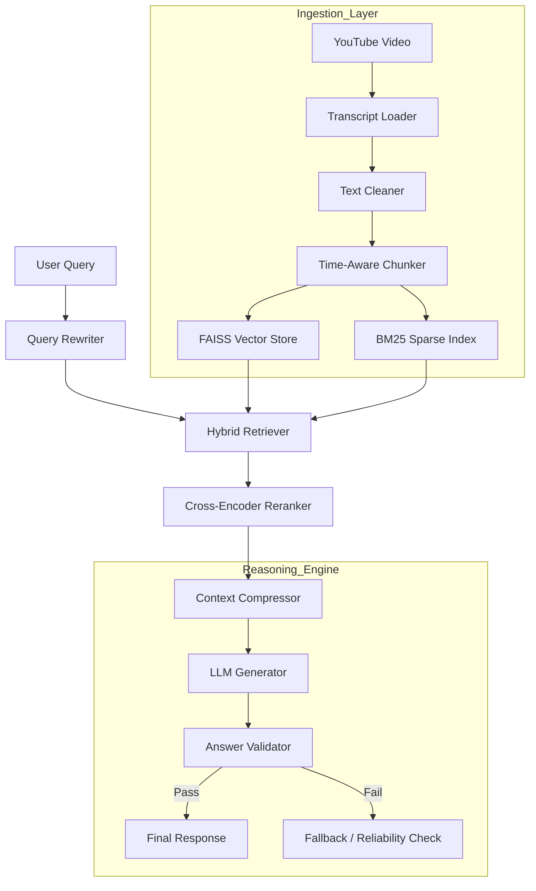

# 🧠 Advanced RAG Agent: YouTubeGPT


> **"Not just a chatbot – an Agentic RAG pipeline architected for precision, reasoning, and strict grounding."**

This project implements a **Production-Grade Retrieval Augmented Generation (RAG)** system capable of deep semantic analysis of YouTube content. It moves beyond simple vector search by implementing **14 core principles** of advanced RAG, including Hybrid Retrieval, Self-Correction, and Time-Aware Chunking.

---

## 🏗️ System Architecture

This system uses a multi-stage reasoning pipeline to ensure answers are not just relevant, but **accurate and grounded**.



---

## 🚀 Key Technical Features

### 1. 🧠 Hybrid Retrieval & Reranking
I don't rely on vector similarity alone.
- **Dense Retrieval**: FAISS index with `sentence-transformers/all-MiniLM-L6-v2` for semantic understanding.
- **Sparse Retrieval**: BM25 algorithm to capture exact keyword matches (often missed by vectors).
- **Reranking**: A Cross-Encoder model re-scores the top results from both streams to prioritize true relevance.

### 2. 🛡️ Hallucination Guardrails
- **Strict Grounding**: The `AnswerValidator` agent creates a feedback loop, checking if the generated answer is strictly supported by the retrieved context.
- **Confidence Scoring**: Every response calculates a confidence score based on retrieval density and semantic distance.

### 3. ⏱️ Time-Aware Chunking
Standard chunking breaks context. Our **Time-Aware Chunker** respects sentence boundaries and timestamps, ensuring that retrieved chunks serve perfectly as video jump-points.

### 4. 🔄 Query Transformation
Users ask vague questions ("What did he say about that?"). The **Query Rewriter** module transforms conversational input into optimized search queries before they touch the index.

### 5. 🔭 Enterprise Observability
Integrated with **LangSmith** to trace every step of the reasoning chain. We don't just guess why an answer failed; we inspect the exact latency, token usage, and intermediate outputs of the RAG pipeline.

### 6. ⚡ Performance Engineering (Dual-Layer Caching)
- **Disk Caching**: Transcripts are locally cached (`data/transcripts/`) to prevent redundant API calls and enable offline development.
- **Session Caching**: The Indexing layer is optimized to skip expensive embedding operations for already-processed videos in the active session.

### 7. 🌊 Streaming Experience
Unlike standard RAG that waits for the full answer, this agent generates the full response for **strict validation** first, then optimizes the UI to **stream** the result token-by-token for a premium user experience.

### 8. 🛡️ Resilience & Fallbacks
The system employs a "waterfall" strategy for ingestion. If the official YouTube API fails (no captions), it automatically degrades to `yt-dlp` to extract auto-generated subtitles, ensuring no video is left behind.

---

## 🛠️ Technology Stack

| Component | Technology | Role |
|-----------|------------|------|
| **LLM** | **Groq Llama 3 / Gemini 1.5** | High-speed inference and reasoning. |
| **Orchestration** | **LangChain** | Chain management and agentic flows. |
| **Vector DB** | **FAISS (CPU)** | Efficient high-dimensional similarity search. |
| **Backend** | **Python** | Core logic and data processing. |
| **Frontend** | **Streamlit** | Interactive chat interface with threading. |
| **Observability** | **LangSmith** | Full-stack tracing and monitoring of LLM chains. |
| **Ingestion** | **Youtube-Transcript-API / yt-dlp** | Robust video data extraction with fallbacks. |

---

## 📂 Project Structure

```bash
📦 Advanced-RAG-Chatbot
├── 📂 app
│   ├── 📂 ingestion      # Loaders, Cleaners, Chunkers
│   ├── 📂 retrieval      # Dense, Sparse, Hybrid, Reranking
│   ├── 📂 reasoning      # Query Rewriting, Prompt Engineering
│   ├── 📂 evaluation     # Validators, Confidence Scorers
│   ├── 📂 vectorstore    # FAISS & Metadata management
│   └── 📂 frontend       # Streamlit UI logic
├── 📜 run.py             # Entry point
└── 📜 requirements.txt   # Dependencies
```

---

## ⚡ Getting Started

### Prerequisites
- Python 3.10+
- API Keys for **Groq**, **Google Gemini**, and **HuggingFace**.

### Installation

1. **Clone & Install**
   ```bash
   git clone https://github.com/yourusername/advanced-rag-chatbot.git
   pip install -r requirements.txt
   ```

2. **Configure Environment**
   Create a `.env` file from the example

3. **Run the Agent**
   ```bash
   streamlit run run.py
   ```

---

## 🔮 Future Improvements
- [ ] **Multi-Modal Support**: Analyzing video frames alongside transcripts.
- [ ] **GraphRAG**: Implementing Knowledge Graphs for entity-relationship mapping.
- [ ] **Local LLM**: Full offline support using Ollama.


