# 🧠 YouTubeGPT - Production-Grade RAG System

[](https://www.python.org/)
[](https://fastapi.tiangolo.com/)
[](https://react.dev/)
[](https://www.langchain.com/)
[](https://www.typescriptlang.org/)

> **An enterprise-grade Retrieval Augmented Generation (RAG) system that transforms YouTube videos and PDFs into an intelligent knowledge base with conversational AI capabilities.**


---

## 🌟 Project Highlights

This isn't just another chatbot demo. **YouTubeGPT** is a **production-ready, full-stack AI application** that demonstrates:

✅ **Advanced RAG Architecture** - Hybrid retrieval (Dense + Sparse) with reranking  
✅ **Full-Stack Implementation** - FastAPI backend + React/TypeScript frontend  
✅ **User Authentication** - JWT-based secure auth with PostgreSQL  
✅ **Multi-Source Ingestion** - YouTube videos + PDF documents  
✅ **Vector Database** - Qdrant cloud integration for semantic search  
✅ **Smart Caching** - Redis for session management & query optimization  
✅ **Production Infrastructure** - Async operations, connection pooling, error handling  
✅ **Modern UI/UX** - Responsive design with Tailwind CSS & Framer Motion  

---

## 🎯 What Makes This Special?

### 1. **Enterprise-Grade Architecture**
```
Frontend (React/TS) → FastAPI Backend → RAG Pipeline → Vector DB (Qdrant)
                                      → PostgreSQL (User/Session Data)
                                      → Redis (Caching Layer)
```

### 2. **Advanced RAG Implementation**
- **Hybrid Retrieval**: Combines dense (semantic) and sparse (BM25) search
- **Cross-Encoder Reranking**: Post-retrieval reranking for precision
- **Query Rewriting**: Intelligent query transformation for better results
- **Context Compression**: Relevance-based context pruning
- **Multi-LLM Support**: Groq, Google Gemini, HuggingFace integration

### 3. **Production-Ready Features**
- **Async Architecture**: Non-blocking I/O operations
- **Connection Pooling**: Optimized database connections
- **Error Handling**: Comprehensive exception management
- **Logging**: Structured logging for debugging
- **Environment Config**: Secure credential management
- **CORS**: Properly configured for production deployment

### 4. **Real-World Use Cases**
- 📚 **Educational Content Analysis**: Process lecture videos and research papers
- 🎥 **Content Creation**: Extract insights from YouTube channels
- 📖 **Document Q&A**: Upload PDFs and ask questions
- 💼 **Knowledge Management**: Build searchable knowledge bases

---

## 🏗️ System Architecture

```mermaid
graph TB
    UI[🎨 React TypeScript UI]
    Auth[🔐 Authentication Context]
    API[📡 Axios API Client]
    
    FastAPI[⚙️ FastAPI Server]
    AuthMW[🛡️ JWT Auth Middleware]
    Routes[🛤️ API Routes]
    
    Ingest[📥 Content Ingestion]
    Chunk[✂️ Smart Chunking]
    Embed[🧮 Embeddings Generation]
    Retrieve[🔍 Hybrid Retrieval]
    Rerank[⭐ Cross-Encoder Reranking]
    LLM[🤖 LLM Generation]
    
    PG[(💾 PostgreSQL)]
    R[(⚡ Redis Cache)]
    Q[(🔮 Qdrant Vector DB)]
    
    UI --> Auth
    Auth --> API
    API --> FastAPI
    FastAPI --> AuthMW
    AuthMW --> Routes
    
    Routes --> Ingest
    Routes --> PG
    Routes --> R
    
    Ingest --> Chunk
    Chunk --> Embed
    Embed --> Q
    
    Routes --> Retrieve
    Retrieve --> Q
    Retrieve --> Rerank
    Rerank --> LLM
```



---

## 🛠️ Tech Stack

### **Backend**
| Technology | Purpose |
|------------|---------|
| **FastAPI** | High-performance async web framework |
| **Python 3.10+** | Core language |
| **LangChain** | LLM orchestration framework |
| **SQLAlchemy** | ORM for PostgreSQL |
| **Qdrant** | Vector database for embeddings |
| **Redis** | Caching & session management |
| **JWT** | Secure authentication |

### **Frontend**
| Technology | Purpose |
|------------|---------|
| **React 19** | UI framework |
| **TypeScript** | Type-safe JavaScript |
| **Vite** | Build tool & dev server |
| **TailwindCSS** | Utility-first CSS |
| **Framer Motion** | Animations |
| **Axios** | HTTP client |

### **AI/ML Stack**
| Technology | Purpose |
|------------|---------|
| **Groq** | Ultra-fast LLM inference |
| **Google Gemini** | Advanced reasoning model |
| **Sentence Transformers** | Text embeddings |
| **FAISS** | Local vector search |
| **BM25** | Sparse retrieval |
| **LangSmith** | LLM observability (optional) |

---

## 📂 Project Structure

```
YouTubeGPT/
├── app/                          # Backend application
│   ├── api/                      # API routes & schemas
│   │   ├── routes.py            # Main RAG endpoints
│   │   ├── auth.py              # Authentication endpoints
│   │   └── schemas.py           # Pydantic models
│   ├── db/                       # Database layer
│   │   ├── connection.py        # PostgreSQL connection pool
│   │   ├── redis_client.py      # Redis client
│   │   └── models.py            # SQLAlchemy models
│   ├── ingestion/               # Content processing
│   │   ├── youtube_loader.py    # YouTube transcript extraction
│   │   ├── pdf_loader.py        # PDF document processing
│   │   └── text_cleaner.py      # Text preprocessing
│   ├── retrieval/               # Hybrid retrieval system
│   │   ├── dense_retriever.py   # Semantic search
│   │   ├── sparse_retriever.py  # BM25 keyword search
│   │   ├── hybrid_retriever.py  # Combined retrieval
│   │   └── reranker.py          # Cross-encoder reranking
│   ├── reasoning/               # Query processing
│   │   ├── query_rewriter.py    # Query transformation
│   │   ├── prompt_builder.py    # Dynamic prompt engineering
│   │   └── context_compressor.py # Context pruning
│   ├── llm/                     # LLM integrations
│   │   └── llm_client.py        # Multi-provider LLM client
│   ├── vectorstore/             # Vector DB management
│   │   ├── faiss_store.py       # Local FAISS operations
│   │   └── metadata_store.py    # Document metadata
│   └── utils/                   # Utilities
│       └── logger.py            # Structured logging
├── web-client/                  # Frontend application
│   ├── src/
│   │   ├── components/          # React components
│   │   │   ├── Login.tsx        # Auth login
│   │   │   ├── Signup.tsx       # User registration
│   │   │   ├── Sidebar.tsx      # Document ingestion UI
│   │   │   └── ChatArea.tsx     # Chat interface
│   │   ├── context/             # React context
│   │   │   └── AuthContext.tsx  # Authentication state
│   │   ├── services/            # API integration
│   │   │   └── api.ts           # Axios client
│   │   └── App.tsx              # Main application
│   └── package.json
├── main.py                      # FastAPI application entry
├── requirements.txt             # Python dependencies
├── .env.example                 # Environment variables template
└── README.md                    # This file
```

---

## ⚡ Quick Start

### Prerequisites
- **Python 3.10+**
- **Node.js 18+**
- **PostgreSQL** (Neon DB or local)
- **Redis** (Redis Cloud or local)
- **Qdrant** (Cloud account)
- API keys: Groq, Google Gemini (optional), HuggingFace

### 1️⃣ Clone & Setup Environment

```bash
git clone https://github.com/AmitS1009/YoutubeGPT.git
cd YoutubeGPT
```

### 2️⃣ Backend Setup

```bash
# Install Python dependencies
pip install -r requirements.txt

# Copy and configure environment variables
cp .env.example .env
# Edit .env with your API keys and database URLs
```

### 3️⃣ Frontend Setup

```bash
# Navigate to frontend directory
cd web-client

# Install dependencies
npm install

# Create frontend .env
echo "VITE_API_BASE_URL=http://localhost:8000" > .env
```

### 4️⃣ Run the Application

**Option 1: Run from root directory (Recommended)**
```bash
npm install
npm run dev
```
This starts both backend (port 8000) and frontend (port 5173) simultaneously.

**Option 2: Manual start**
```bash
# Terminal 1 - Backend
uvicorn main:app --reload --port 8000

# Terminal 2 - Frontend
cd web-client
npm run dev
```

### 5️⃣ Access the Application

- **Frontend**: http://localhost:5173
- **Backend API**: http://localhost:8000
- **API Docs**: http://localhost:8000/docs

---

## 🎮 Usage Guide

### 1. **Sign Up & Login**
- Create a new account or login with existing credentials
- JWT tokens are used for secure session management

### 2. **Ingest Content**
- **YouTube Video**: Paste a YouTube URL and click process
- **PDF Document**: Upload a PDF file for processing

### 3. **Ask Questions**
- Type natural language questions about your ingested content
- The RAG system retrieves relevant context and generates accurate answers

### 4. **Smart Features**
- **Query Rewriting**: Your questions are automatically optimized
- **Hybrid Search**: Combines semantic and keyword matching
- **Smart Ranking**: Results are reranked for maximum relevance

---

## 🏆 Key Technical Achievements

### 1. **Advanced RAG Pipeline**
- Implemented **14 RAG best practices** including:
  - Hybrid retrieval (dense + sparse)
  - Cross-encoder reranking
  - Query transformation
  - Context compression
  - Multi-stage reasoning

### 2. **Production-Grade Backend**
- **Async FastAPI** with proper connection pooling
- **JWT authentication** with secure password hashing (Argon2)
- **PostgreSQL** for persistent user/session storage
- **Redis caching** for performance optimization
- **Structured logging** for debugging

### 3. **Modern Frontend**
- **React 19** with TypeScript for type safety
- **Context API** for global state management
- **Protected routes** with authentication guards
- **Responsive design** with TailwindCSS
- **Smooth animations** with Framer Motion

### 4. **Multi-Modal Content Processing**
- **YouTube**: Automatic transcript extraction with fallback mechanisms
- **PDF**: Text extraction with proper chunking
- **Time-aware chunking**: Preserves context boundaries

---

## 📊 Performance Optimizations

| Feature | Implementation | Benefit |
|---------|---------------|---------|
| **Connection Pooling** | SQLAlchemy with asyncpg | Reduced DB latency |
| **Redis Caching** | Session & query caching | 10x faster repeat queries |
| **Async Operations** | FastAPI async endpoints | Non-blocking I/O |
| **Batch Processing** | Vectorized embeddings | Faster ingestion |
| **Lazy Loading** | On-demand model loading | Reduced memory footprint |

---

## 🔮 Future Enhancements

- [ ] **Multi-modal RAG**: Add image/video frame analysis
- [ ] **GraphRAG**: Implement knowledge graph integration
- [ ] **Real-time Streaming**: WebSocket-based response streaming
- [ ] **Advanced Analytics**: User query analytics dashboard
- [ ] **Docker Deployment**: Containerized deployment setup
- [ ] **Kubernetes**: Production-grade orchestration
- [ ] **Rate Limiting**: API request throttling
- [ ] **A/B Testing**: Multiple RAG pipeline variants

---

## 📈 Use Cases & Applications

1. **Education**: Process lecture videos and textbooks for student Q&A
2. **Research**: Extract insights from academic papers and conference talks
3. **Content Creation**: Analyze competitor content and trends
4. **Corporate Training**: Build searchable knowledge bases from training materials
5. **Customer Support**: Create AI assistants trained on product documentation

---

## 👨‍💻 Development

### Running Tests
```bash
# Backend tests
pytest

# Frontend tests
cd web-client
npm test
```

### Code Quality
```bash
# Python linting
pylint app/

# TypeScript linting
cd web-client
npm run lint
```

---

## 📝 License

This project is licensed under the MIT License - see the LICENSE file for details.

